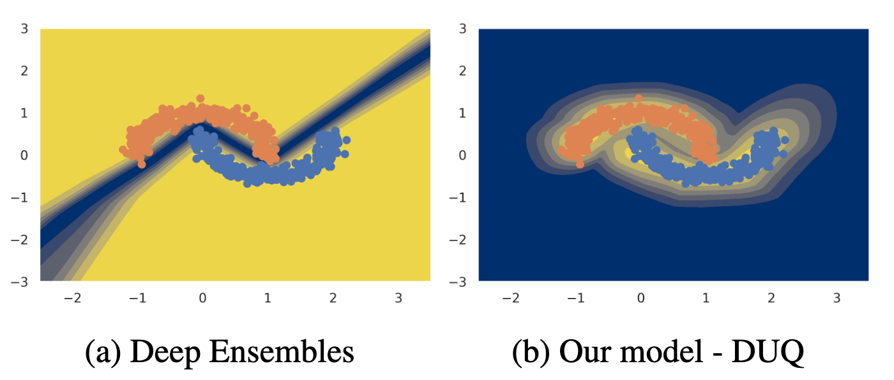

# Deterministic Uncertainty Quantification (DUQ)

This repo contains the code for [*Uncertainty Estimation Using a Single Deep Deterministic Neural Network*](https://arxiv.org/abs/2003.02037), which is accepted for publication at ICML 2020.

If the code or the paper has been useful in your research, please add a citation to our work:

```
@article{van2020uncertainty,
  title={Uncertainty Estimation Using a Single Deep Deterministic Neural Network},
  author={van Amersfoort, Joost and Smith, Lewis and Teh, Yee Whye and Gal, Yarin},
  booktitle={International Conference on Machine Learning},
  year={2020}
}
```

## Dependencies

The code is based on PyTorch and requires a few further dependencies, listed in [environment.yml](environment.yml).
The code was tested with the versions specified in the environment file, but should work with newer versions as well.
If you find an incompatibility, please let me know and I'll gladly update the code for the newest version of each library.

### Datasets

Most datasets will be downloaded on the fly by Torchvision. Only NotMNIST needs to be downloaded in advance in a subfolder called `data/`:

```
mkdir -p data && cd data && curl -O "http://yaroslavvb.com/upload/notMNIST/notMNIST_small.mat"
```

FastFashionMNIST is based on [this script](https://gist.github.com/y0ast/f69966e308e549f013a92dc66debeeb4).
The default Torchvision implementation first creates a PIL image (see [here](https://github.com/pytorch/vision/blob/v0.6.1/torchvision/datasets/mnist.py#L94)) which creates a CPU bottleneck (while training on GPU).
The FastFashionMNIST class provides a significant speed up.

## Running

The Two Moons experiments can be replicated using the [Two Moons notebook](two_moons.ipynb).
The FashionMNIST experiment is implemented in [train\_duq\_fm.py](train_duq_fm.py).
For both experiments, the paper's default are hardcoded and can be changed in place.

The ResNet18 based CIFAR experiments are implemented in [train\_duq\_cifar.py](train_duq_cifar.py).
All command line parameter defaults are as listed in the experimental details in Appendix A of the paper.

For example: CIFAR-10 with gradient penalty with weight 0.5 and full training set:

```
python train_duq_cifar.py --final_model --l_gradient_penalty 0.5
```

Note that ommitting `--final_model` will lead to 20\% of the training data to be used for validation, such that hyper parameter selection can be done in a responsible manner.

I also include code for my implementation of Deep Ensembles.
It's a very simple implementation that achieves good results (95\% accuracy in 75 epochs using 5 models).
The code is based on [this script](https://gist.github.com/y0ast/d91d09565462125a1eb75acc65da1469) which is example code for training a single model on CIFAR-10.

```
python train_deep_ensemble.py --dataset CIFAR10
```

This command will train a Deep Ensemble consisting of 5 models (the default) on CIFAR10.

## Questions

For questions about the code or the paper, feel free to open an issue or email me directly.
My email can be found on my GitHub profile, my [website](https://joo.st) and the paper above.



